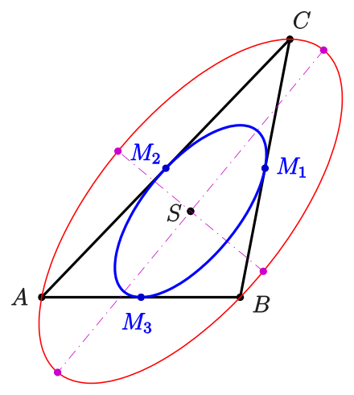
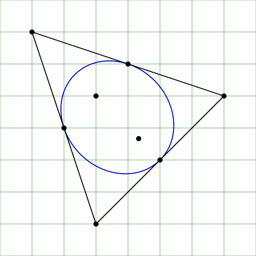

# Selected Problems in Complex Analysis

**Collaborator**: [Alexei Poltoratski](https://people.math.wisc.edu/~poltoratski/), Department of Mathematics, UW-Madison

This project explores a range of complex analysis problems, including applications and notable theorems. Below, you’ll find visual highlights and a link to the full project document.

## Visual Highlights

### Key Figures

   

       
       
Figure 1: Steiner Inellipse (Source: <a href="https://en.wikipedia.org/w/index.php?title=Steiner_inellipse&oldid=1126942784">Wikipedia contributors</a>)

   

   

       
       
Figure 2: Steiner Inellipse Variation (Source: <a href="https://en.wikipedia.org/w/index.php?title=Steiner_inellipse&oldid=1126942784">Wikipedia contributors</a>)

   

   

       
       
Figure 3: Swiss Cheese Example (Source: <a href="https://explainingmaths.wordpress.com/2022/03/08/alice-roth-and-swiss-cheeses/">Explaining Maths</a>)

   

## PDF Document

For a detailed presentation of the project, view the full PDF below.

<iframe src="Selected_problems_in_Complex_Analysis.pdf" width="100%" height="600px">
    This browser does not support PDFs. Please download the PDF to view it:
    <a href="Selected_problems_in_Complex_Analysis.pdf">Download PDF</a>.
</iframe>
