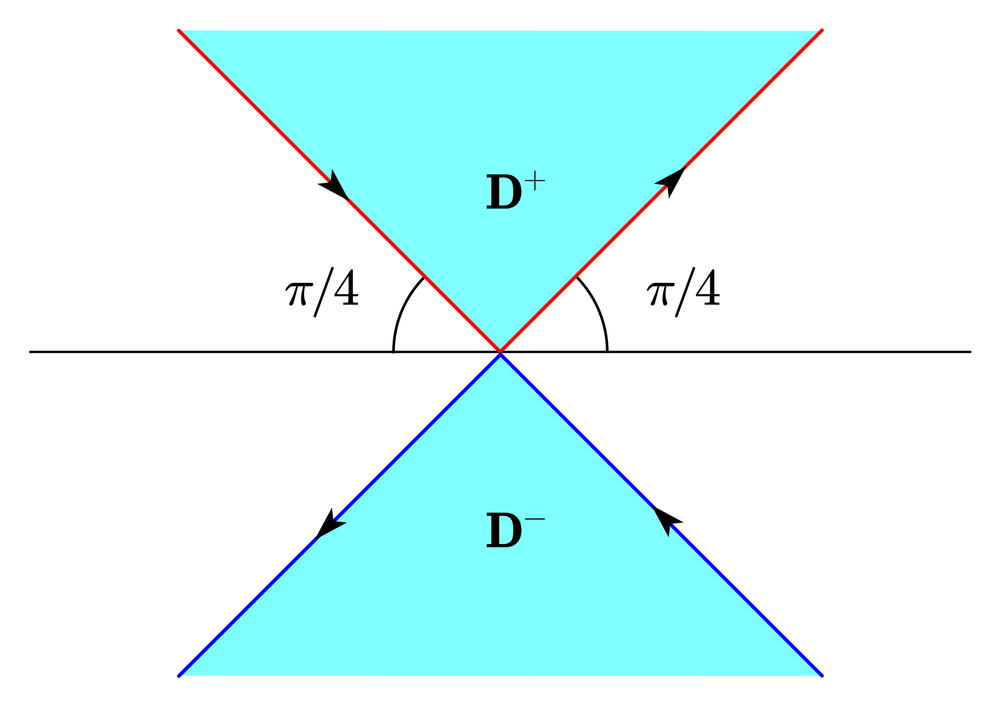
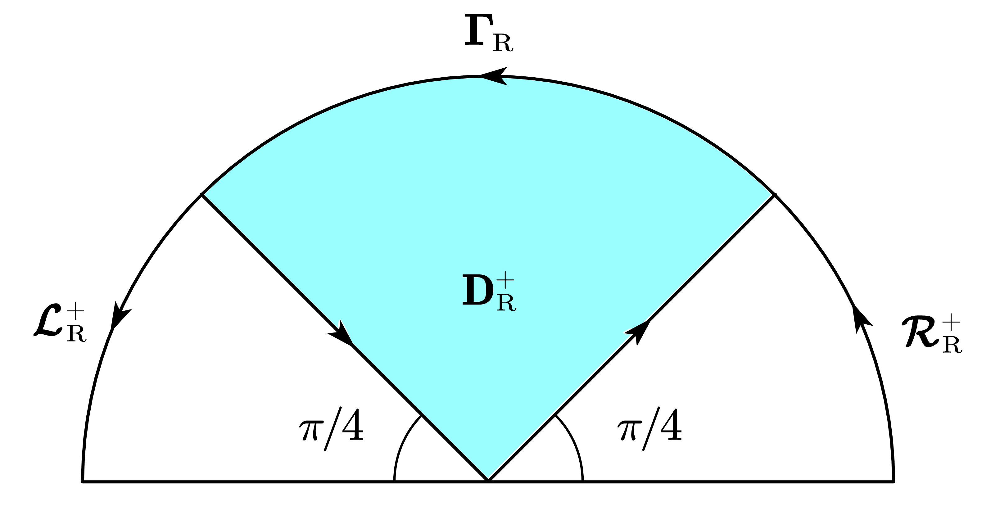
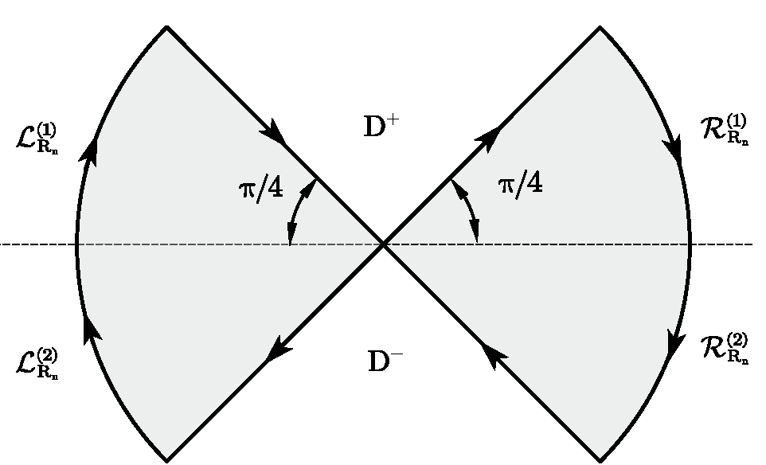
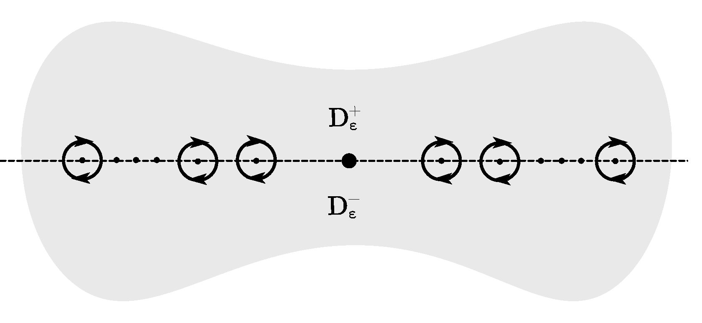

# Fokas Method for Initial Boundary Value Problems of Heat Equations

**Supervisor**: [Jean-Luc Thiffeault](https://people.math.wisc.edu/~thiffeault/), Chair, Department of Mathematics, UW-Madison

This project focuses on applying the Fokas method to solve initial boundary value problems (IBVPs) in heat equations. Below, you’ll find some key visual results and details about our approach.

## Visual Highlights

### Key Figures

   

       
   

   

       
   

   

       
   

   

       
   

## PDF of Full Method

For a detailed presentation, view the full PDF of the Fokas method application below.

<iframe src="Fokas_method_for_heat_equations.pdf" width="100%" height="600px">
    This browser does not support PDFs. Please download the PDF to view it:
    <a href="Fokas_method_for_heat_equations.pdf">Download PDF</a>.
</iframe>

